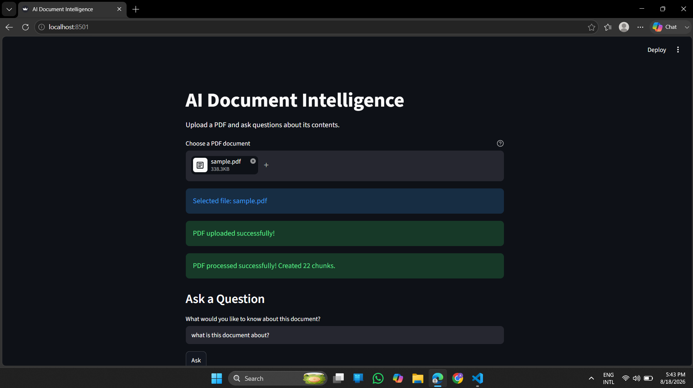
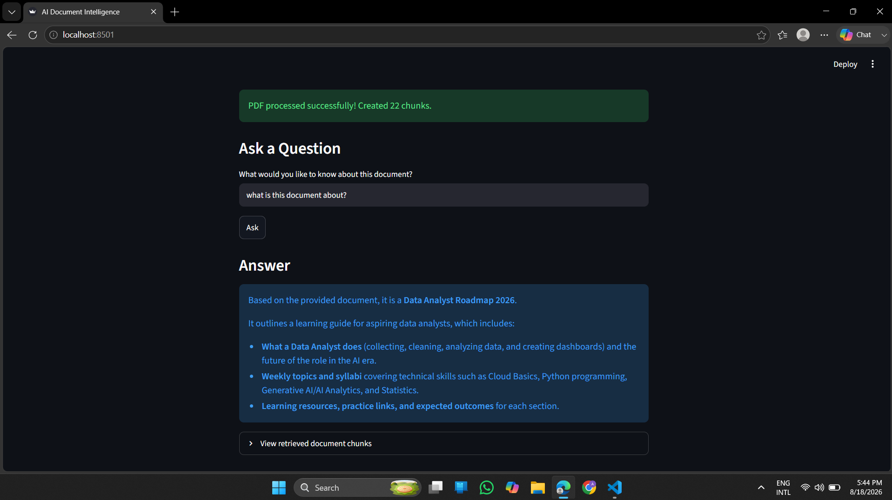

# 📃 AI Document Intelligence

An AI-powered document question-answering application that allows users to upload PDF documents and ask questions about their content.

The application uses Retrieval-Augmented Generation (RAG) to retrieve relevant information from the uploaded document and generate answers using an LLM.

## 💭 Project Objective

The goal of this project is to build an AI-powered system that can understand PDF documents and answer user questions using Retrieval-Augmented Generation (RAG), reducing the need to manually search through lengthy documents. 

## 🚀 Features
- Upload PDF documents
- Extract and split document text into chunks
- Generate embeddings using Sentence Transformers
- Store and search document embeddings using ChromaDB
- Generate answers using a Large Language Model (LLM)
- Ask questions about the uploaded content
- Simple web interface using Streamlit

## ⚙️ Technologies Used
- Python
- Streamlit
- PyMuPDF
- Sentence Transformers
- ChromaDB
- Google Gemini API
- RAG (Retrieval-Augmented Generation)
- Git & GitHub

## 🔃 How It Works

```text
Upload PDF
    ↓
Extract Text
    ↓
Split Text into Chunks
    ↓
Generate Embeddings
    ↓
Store Embeddings in ChromaDB
    ↓
User Asks a Question
    ↓
Convert Question into Embedding
    ↓
Retrieve Relevant Document Chunks
    ↓
Send Context + Question to LLM
    ↓
Generate Answer
```

## 📂 Project Structure

```text
AI-Document-Intelligence/
│
├── app.py
├── src/
│   └── pdf_processor.py
├── requirements.txt
├── .gitignore
└── README.md
```

## ⚙️ Installation

### 1. Clone the repository
 
```bash
git clone https://github.com/aaliyaaafrin/AI-Document-Intelligence.git
cd AI-Document-Intelligence
```

### 2. Create a virtual environment 

```bash
python -m venv venv
```

### 3. Activate the virtual environment
Windows:

```bash
venv\Scripts\activate
```

### 4. Install dependencies

```bash
pip install -r requirements.txt
```

### 5. Add your API key
Create a .env file in the project folder:

GOOGLE_API_KEY=your_api_key_here

⚠️ Do not upload .env or API keys to GitHub. Make sure it is added to .gitignore.

## ▶️ Run the application

```bash
streamlit run app.py
```

The app will open in your browser automatically.

## 🖥️ Application Preview





## 💻 How to Use

1. Run the application using Streamlit.
2. Upload a PDF document.
3. Wait for the document to be processed.
4. Enter a question related to the uploaded document.
5. The application retrieves relevant information and generates an answer using the LLM.

## 🧠 What I Learned
- Document processing and text extraction
- Chunking strategies for LLMs
- Embeddings and semantic search
- Vector databases (ChromaDB)
- Retrieval-Augmented Generation (RAG)
- Working with LLM APIs (Gemini)
- Streamlit app development
- Git & GitHub workflow

## 🔮 Future Improvements
- Support multiple document uploads
- Add chat history memory
- Add document summarization feature 
- Improve retrieval accuracy 
- Add source citations to generated answers
- Deploy the application to the cloud